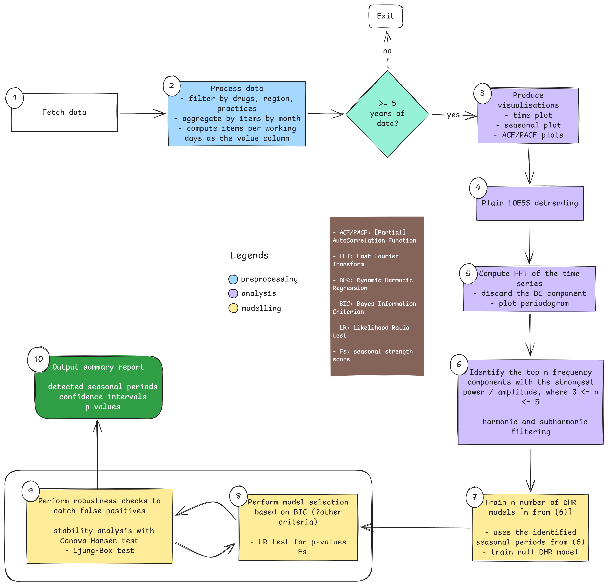

# Project Team/Authors
**GitHub repository**: [bennettoxford/op-seasonality](https://github.com/bennettoxford/op-seasonality)

1. **Abdulrasheed, Nasir**: Conceptualisation, formal analysis, methodology, software, validation, visualisation.
2. **Andrews, Colm**: Conceptualisation, supervision, project administration, methodology, software, validation.
3. **Ojedele, Lola**: Project administration, supervision, software, validation

# Background

**Research question**: *How well does FFT-based seasonality autodetection perform on the monthly practice-level English Prescribing Data (EPD) from March 2016 to April 2026?*

Autodetecting seasonality in prescription patterns of drugs is a useful, albeit difficult-to-implement, capability. The difficulty stems from the complexity of time-series data, with the best method being different depending on the data. This implementation will use a Fast Fourier Transform (FFT)-based method and build on the work in [@seasonality_nb_inspo]. While FFT-based and hybrid FFT/ARIMA methods for time series analysis have been developed and applied elsewhere, they have yet to be applied to the EPD and automated in this manner [@barrett_asthma_2021;@frazer_analysis_2021;@musbah_identifying_2019;@musbah_novel_2020;@musbah_sarima_2019;@savini_automatic_2024].

This project will help provide an automated process and tool to detect seasonality patterns in primary care medication prescribing in England.

# Objectives

## Primary Objectives
1. To build an end-to-end pipeline in a Quarto notebook that takes monthly prescribing time-series data and detects seasonality in prescribing for any drugs in the data (if any) using an FFT-based approach, specifically DHR.
2. To evaluate the above pipeline on OpenPrescribing data for two groups of drugs suspected of having seasonal prescribing patterns.

## Secondary Objectives
1. To decompose and investigate the region-level and/or ICB-level differences in the seasonal pattern of the drugs in the examined data.
2. To produce a dashboard that can ingest a codelist and produce a time-series analysis of the data and an estimate of the confidence in the pattern found, if any.

# Methods
See @fig-pipeline for the full detection pipeline layout.

::: {#fig-pipeline}

Seasonality detector pipeline
:::

## Study Design
This study is a retrospective time-series analysis of monthly practice-level prescribing data in English primary care. Antidepressants and antihistamines have been established to elicit a circannual variation in prescribing from previous studies [@ruzhdi_seasonal_2021;@lansdall-welfare_seasonal_2019]. This study will use data on both groups from May 2016 to April 2026 to develop the initial FFT and DHR-based pipeline for autodetecting seasonal patterns and periodicity. Subsequently, data on norethisterone and depot antipsychotics will be used to stress test the pipeline.

## Data Sources

### OpenPrescribing
The OpenPrescribing database imports openly accessible prescribing data from the large monthly files published by the NHSBSA, which contain data on cost and items prescribed for each month, for every typical GP in England since mid-2010. These data are sourced from community pharmacy claims data and, therefore, contain all items that were dispensed. This data is not linked to patient-level data so does not allow for identification of sub-populations of interest.

## Study Population
We will extract all available prescribing data, limited to institutions with setting code 4 - general practices, according to the NHS Digital dataset of practice characteristics. This excludes all other organisations such as prisons and out-of-hours services as they are not represented fully or consistently in the OpenPrescribing dataset since many of these prescriptions would not be dispensed in community pharmacies.

## Drug Definition
The group of drugs used in this study are grouped under the following codelists:

1. Antidepressants (BNF codes: 0403*********)
2. Antihistamines (BNF codes: 030401**********)
3. Norethisterone (BNF codes: 0604012P0****)
4. Antipsychotic depot injections (BNF codes: 040202******)

## Study Measures
We will use GP data from OpenPrescribing to extract monthly data for the following measures:

1. Total monthly quantity of the drugs under consideration
2. Monthly items per working day (This is to eliminate potentially spurious time series signals due to significant difference in number of working days among months in the data).

### Covariates
The above described measures will be stratified by the following:

- None

### Sensitivity Analyses
Proposed sensitivity analyses include:

1. Examining the difference in pipeline outputs when using the monthly total items series versus using the monthly total items per working day series.
2. Examining the robustness of the pipeline to disruptive events such as the COVID-19 pandemic.
2. Examining how the pipeline performs with various hyperparameter values for different steps in the pipeline.

## Statistical Analysis
The project starts with implementing the pipeline shown in Op Protocol Template Nasir using Quarto with R. For each step of the pipeline, there are different statistical tools employed:

1. Fetch the data from the OpenPrescribing database
2. Pre-process the data:
    - Calculate the number of full years in the time series, and stop if there are fewer than 5.
    - Aggregate the data by month
    - Calculate the items per working day for each month to remove potentially spurious seasonal patterns due to differences in the number of working days across months.
3. Visualise the time series with time, seasonal, and ACF plots.
4. Detrend the data using plain LOESS regression to avoid the trend bleeding into the FFT to be computed next.
5. Perform FFT analysis to identify candidate seasonal periods, ensuring to discard harmonics as appropriate.
6. Fit several DHR models based on the seasonal periods identified.
    - Also fit a null model (no seasonality) for comparison and model selection
7. Perform model selection using 𝚫BIC >= 6 (might change) as the criterion
    - Perform likelihood ratio analysis
    - Compute seasonal strength scores for the fitted models
8. Stability analysis (with Canova-Hansen test) on the best-fit model, if any.
9. Print out a summary report of findings across all the analysis steps applied.

### Limitation
OpenPrescribing data consists of the openly available English Prescribing dataset (EPD) which is aggregated at practice level and does not include any patient information. We are unable to link this with person-level data. As such we are unable to fully investigate the impact of inequalities on ...

The English Prescribing Dataset does not include indication-level prescribing data. We are, therefore, unable to tell the indication for treatment. 

# Results
## Table Shells / Mockup Figures

# Future Work
Potential follow-up work might include:

- Training an RNN or other neural networks on the model on the data for seasonality detection.
- Currating a labelled dataset of pipeline outputs and outcomes of seasonality (yes vs no, seasonal period) and training an ML model on it.

# References
::: {#refs}
:::
