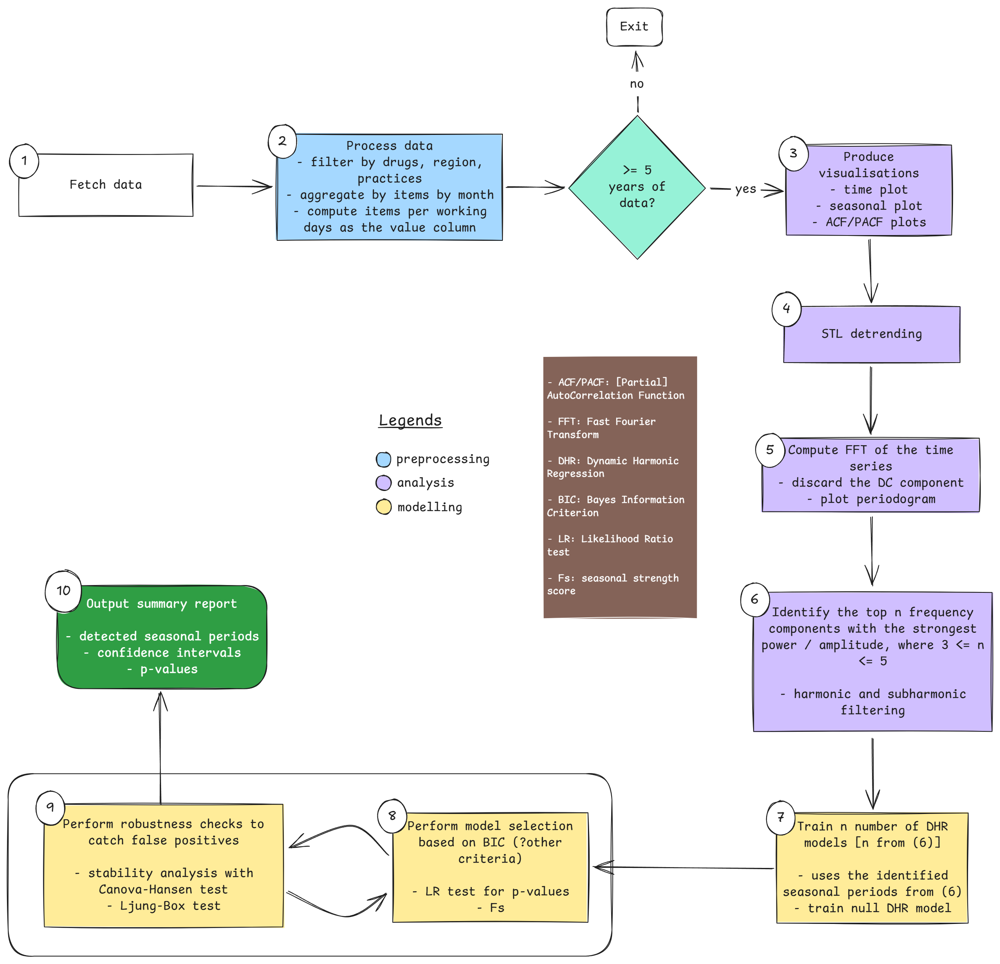

# Introduction
The aim of this project is to create a robust pipeline in `R` that automates the detection of seasonal patterns in English prescribing using data from [OpenPrescribing](https://openprescribing.net). The ten steps of the pipeline are depicted in @fig-pipeline.

::: {#fig-pipeline}


Seasonality detector pipeline
:::

```{r}
#| label: setup
#| output: false
#| code-fold: true

library(tidyverse)
library(arrow)
library(gt)
library(fpp3)
library(bizdays)
library(timeDate)
library(patchwork)
library(here)
library(glue)
library(purrr)

MAX_PRODUCTS <- Inf

SERTRALINE_HCL <- "0403030Q0"
ESCITALOPRAM <- "0403030X0"
LORATADINE <- "0304010D0"
FEXOFENADINE_HCL <- "0304010E0"

DATA_DIR <- "data/"
PLOTS_DIR <- "images/"
DATE_START <- "2016-05-01"
DATE_END <- "2026-04-01"
```

# Step 1: Load data
Loading data from disk. @tbl-load-data shows the expected shape of the data expected to be fed into the pipeline.

```{r}
#| label: tbl-load-data
#| tbl-cap: Monthly prescribing data for select drugs (May 2016 to April 2026)
#| code-fold: true

bnf_file <- glue("bnf_dev_{DATE_START}_{DATE_END}.parquet")
df_dev_bnf <- read_parquet(here("data-raw", "nasir", bnf_file))

presc_file <- glue("dev_drugs_{DATE_START}_{DATE_END}.parquet")
df_dev_drugs <- read_parquet(here("data-raw", "nasir", presc_file))

DF_PRESC <- df_dev_drugs |>
  left_join(df_dev_bnf, c("bnf_code" = "presentation_code"))

n_months <- unique(DF_PRESC$month) |> length()

head(DF_PRESC, 5) |> gt()
```

The data used spans exactly `r {n_months}` months.

# Step 2: Preprocessing

Define accessory functions to compute the number of business days in a specific month (given the month and year), taking into account weekends and bank holidays:

```{r}
#| label: func-work-days
#| warning: false
#| code-fold: true

uk_holidays <- as.Date(holidayLONDON(year(DATE_START):year(DATE_END)))

cal <- create.calendar(
  name = "UK",
  weekdays = c("saturday", "sunday"),
  holidays = uk_holidays
)

month_work_days <- function(date) {
  start_date <- as.Date(date)
  end_date <- seq(start_date, by = "month", length.out = 2)[2] - 1
  length(bizseq(start_date, end_date, cal))
}
```

The data is then aggregated by `month`, `chemical_code`, and `chemical` columns to create a monthly `total_items` column that holds the total items of that chemical dispensed in a given month across English primary care. @tbl-aggregated-data shows a sample of the resulting data following aggregation.
```{r}
#| label: func-aggregate-data

aggregate_ts <- function(df) {
  df |>
    summarise(
      total_items = sum(items),
      .by = c(month, chemical_code, chemical)
    ) |>
    mutate(month = yearmonth(month)) |>
    as_tsibble(index = month, key = c(chemical, chemical_code)) |>
    mutate(items_per_wd = total_items / map_dbl(month, month_work_days))
}
```

```{r}
#| label: tbl-aggregated-data
#| tbl-cap: Aggregated time series data
#| code-fold: true

DF_PRESC_AGG <- aggregate_ts(DF_PRESC)
df_sertraline <- filter(DF_PRESC_AGG, chemical_code == SERTRALINE_HCL)
df_escitalopram <- filter(DF_PRESC_AGG, chemical_code == ESCITALOPRAM)
df_loratadine <- filter(DF_PRESC_AGG, chemical_code == LORATADINE)
df_fexofenadine <- filter(DF_PRESC_AGG, chemical_code == FEXOFENADINE_HCL)

head(DF_PRESC_AGG, 5) |> gt()
```

# Step 3: Visualisation
For all chemicals present in the data, we plotted time, seasonal, seasonal subseries, and [ACF](https://en.wikipedia.org/wiki/Autocorrelation) plots.
```{r}
#| label: func-visualise
#| code-fold: true

visualise_ts <- function(ts, plot_title = NULL) {
  if (!inherits(ts, "tbl_ts")) {
    stop("Argument `ts` must be a time series object")
  }

  chems <- unique(ts$chemical)
  plots <- list()
  for (i in seq_along(chems)) {
    chem <- chems[i]
    chem_ts <- filter(ts, chemical == chem)
    time_plot <- chem_ts |>
      autoplot(total_items) +
      theme(legend.position = "none") +
      theme_minimal() +
      labs(y = "Total items", x = "Month [1M]")

    seasonal_plot <- chem_ts |>
      gg_season(total_items) +
      theme_minimal() +
      labs(y = "Total items", x = "Month [1M]")

    subseries_plot <- chem_ts |>
      gg_subseries(total_items) +
      theme_minimal() +
      theme(
        axis.text.x = element_text(angle = 90, hjust = 1),
        strip.text.y = element_blank(),
        strip.background = element_blank()
      ) +
      labs(y = "Total items", x = "Year")

    acf_plot <- chem_ts |>
      ACF(total_items) |>
      autoplot() +
      theme_minimal() +
      labs(y = "ACF", x = "Lag [1M]")

    p <- (time_plot / seasonal_plot / subseries_plot / acf_plot) +
      plot_annotation(title = chem)
    # ggsave(
    #   paste0(PLOTS_DIR, plot_title, ".png"),
    # )

    print(p)
  }
}
```
@fig-vis-test shows the output of the visualising function for one chemical (Sertraline Hydrochloride, BNF code `r {SERTRALINE_HCL}`).
```{r}
#| label: fig-vis-test
#| fig-cap: Output of the `visualise_ts` function
#| code-fold: true

visualise_ts(df_sertraline)
```

<!-- The @fig-fig-time-plots;@fig-seasonal-plots;@fig-acf-plots show individual plots of each  -->
<!-- ```{r}
#| label: fig-time-plots
#| fig-cap: Time plots of total monthly items time series

DF_PRESC_AGG |>
  autoplot(total_items) +
    facet_wrap(~chemical, scales = "free") +
    theme_minimal() +
    theme(
      legend.position = "none",
      axis.text.x = element_text(angle = 45, hjust = 1)
    ) +
    labs(y = "Total items", x = "Month [1M]")
``` -->

<!-- ```{r}
#| label: fig-seasonal-plots
#| fig-cap: Time plots of total items time series

DF_PRESC_AGG |>
  gg_season(total_items) +
    facet_wrap(~chemical, scales = "free") +
    theme_minimal() +
    theme(axis.text.x = element_text(angle = 45, hjust = 1)) +
    labs(y = "Total items", x = "Month [1M]")
``` -->

<!-- ```{r}
#| label: fig-acf-plots
#| fig-cap: ACF of monthly item per working day time series

DF_PRESC_AGG |>
  ACF(total_items) |>
  autoplot() +
    facet_wrap(~chemical, scales = "free") +
    theme_minimal() +
    labs(y = "Total items", x = "Month [1M]")
``` -->

# Step 4: STL Detrending

In this step, the detrended time series is obtained from an [STL](https://otexts.com/fpp3/stl.html) decompoisition of the original time series. The detrended series is then plotted (see @fig-detrended-plots).

```{r}
#| label: func-detrend

detrend <- function(ts, w = 13) {
  ts |>
    model(
      STL(total_items ~ trend() + season(), robust = TRUE)
    ) |>
      components()
}

detrended_plots <- function(ts_decomp) {
  rows <- length(unique(ts_decomp$chemical))
  p <- ggplot(ts_decomp) +
    geom_line(aes(x = month, y = season_year)) +
    facet_wrap(~chemical, scales = "free", nrow = rows) +
    theme_minimal() +
    theme(legend.position = "none") +
    labs(
      x = "Month",
      y = "Total items"
    )

  p
}
```

# Step 5 & 6: FFT filtering and candidate periods selection

A fast fourier transform ([FFT](https://en.wikipedia.org/wiki/Fast_Fourier_transform)) of the detrended time series is taken to see the component signals (seasonalities) and their respective amplitudes/strength. For computing the FFT of the series, we use the last `n` months of the series that makes up full years. `n` is given by:

$$
n = 12 \left\lfloor \frac{total\ months}{12} \right\rfloor
$${#eq-year-months}

```{r}
#| label: fft-functions
#| code-fold: true

compute_fft <- function(ts) {
  if (!is.vector(ts)) {
    stop("Argument `ts` must be a vector")
  }

  len_ts <- length(ts)
  n_months = 12 * (len_ts %/% 12)

  ts <- ts[(len_ts - n_months):len_ts]
  len_ts <- n_months / 2

  amps <- fft(ts) |> abs()

  amps[2:len_ts]
}

filter_harmonics <- function(fft_amps, top_k = 1) {
   if (!is.vector(fft_amps)) {
    stop("Argument `fft_amps` must be a vector")
  }

  if (top_k > length(fft_amps)) {
    stop("`top_k` cannot exceed the length of `fft_amps` amplitudes vector")
  }

  sort_idx <- order(fft_amps, decreasing = TRUE)
  amps <- fft_amps[sort_idx[1:top_k]]
  candidates <- sort_idx[1:top_k]

  # TODO: harmonic filtering logic here

  list(freqs = candidates, amps = amps)
}

plot_fft <- function(ts_fft, chemical) {
  if (!is.vector(ts_fft)) {
    stop("Argument `ts_fft` must be a vector")
  }

  len_ts <- length(ts_fft)

  freqs <- 1:len_ts

  spectral_plot <- ggplot(mapping = aes(x = freqs, y = ts_fft)) +
    geom_segment(aes(xend = freqs, y = 0, yend = ts_fft), colour = "steelblue") +
    geom_point(colour = "steelblue", size = 1) +
    theme_minimal() +
    labs(
      x = "",
      y = "Power",
      title = chemical
    )

  spectral_plot
}
```

@fig-spectral-plots shows the [periodograms](https://en.wikipedia.org/wiki/Periodogram) for the chemicals in the current data. It shows the frequecies/wave number of the seasonal signals present in the time series, along with their respective amplitdes/power. The seasonal period, $p$, which is the number of month after which the seasonal signal repeats is given by:

$$
p = n / f
$${#eq-period}
where $n$ is the number of months from @eq-year-months and $f$ is the frequenc/wave number from the x axis of the periodograms. So for frequency 10, seasonal period is $`r {n_months}` / 10 = 12\ months$, for frequency 20, $p$ is $`r {n_months}` / 20 = 6\ months$, etc.

```{r}
#| label: func-fft-score
#| code-fold: true

score <- function(ts_dable, top_k =  1) {
  chems <- unique(ts_dable$chemical)
  scores <- tibble()
  plots <- list()

  for (i in seq_along(chems)) {
    chem <- chems[i]
    chem_dable <- ts_dable |>
      filter(chemical ==  chem)

    n_months = 12 * (nrow(chem_dable) %/% 12)
    fft_res <- chem_dable |>
      pull(season_year) |>
      compute_fft()

    plots[[i]] <- plot_fft(fft_res, chem)

    amps_freqs <- filter_harmonics(fft_res, top_k)
    tmp_df <- tibble(chemical = chem)
  
    for (j in 1:top_k) {
      col_period <- paste0("period_", j)
      col_score <- paste0("score_", j)

      tmp_df <- bind_cols(
        tmp_df,
        tibble(
          "{col_period}" := n_months / amps_freqs$freqs[j],
          "{col_score}" := amps_freqs$amps[j]
        )
      )
    }
  
    scores <- bind_rows(scores, tmp_df)
  }

  list(plots = plots, scores = scores)
}
```

# Full Pipeline
Putting it all together.

### Aggregation and Visualisation 
```{r}
#| label: fig-vis
#| fig-cap: Plots of original time series

df_presc_agg <- aggregate_ts(DF_PRESC)

purrr::walk(visualise_ts(df_presc_agg), print)
```

### Detrending
```{r}
#| label: fig-detrended-plots
#| fig-cap: Detrended time plots

df_decomp <- detrend(df_presc_agg)

detrended_plots(df_decomp)
```

### FFT
```{r}
#| label: fig-spectral-plots
#| fig-cap: Spectral plots

TOP_K <- 5
fft_scores <- score(df_decomp, top_k = TOP_K)

wrap_plots(fft_scores$plots, ncol = 2)
```

### Candidate periods
```{r}
#| label: tbl-fft-periods
#| tbl-cap: !expr glue("Candidate periods found and their signal strength from FFT (Top {TOP_K})")

gt(fft_scores$scores)
```
